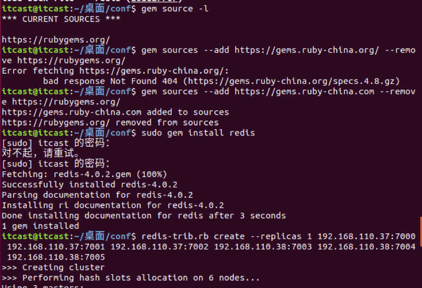

# 安装
当前redis最新稳定版本是4.0,常用版本是3.2

1.下载
```shell
wget http://download.redis.io/releases/redis-3.2.8.tar.gz
```
2.解压安装包
```shell
tar -zxvf redis-3.2.8.tar.gz
```
3.复制包到/usr/local/redis下
```shell
sudo mv ./redis-3.2.9 /usr/local/redis/
```
4.进入redis目录
```shell
cd /usr/local/redis/
```
5.编译
```shell
a)安装c语言编译器gcc 
    sudo apt-get install gcc
b)安装编译命令make   
    sudo apt-get install make(这一步可能会出问题，根据提示执行命令)
c)生成 
    sudo make(比较慢)
```
6.进入src执行测试命令
```shell
sudo make test
```
如果产生如下错误：

解决方法如下
```shell
cd 

wget 
http://downloads.sourceforge.net/tcl/tcl8.6.1-src.tar.gz

sudo tar xzvf tcl8.6.1-src.tar.gz  -C /usr/local/

cd  /usr/local/tcl8.6.1/unix/

sudo ./configure

sudo make（时间比较长）

sudo make install 
```
7.到/usr/local/redis安装,将redis的命令安装到/usr/local/bin/⽬录
```shell
sudo make install  （时间比较长）
```
8.安装完成后，我们进入目录/usr/local/bin中查看是否有五个安装包
```shell
cd /usr/local/bin
ls -all 
```

```shell
a)redis-server      redis服务器
b)redis-cli          redis命令行客户端
c)redis-benchmark  redis性能测试工具
d)redis-check-aof    AOF文件修复工具
e)redis-check-rdb    RDB文件检索工具
```
9.配置文件

•配置⽂件⽬录为/usr/local/redis/redis.conf
```shell
sudo cp /usr/local/redis/redis.conf /etc/redis/
```

# 配置
1.查看

```shell
sudo vi /etc/redis/redis.conf
```
2.配置

(1)绑定ip：如果需要远程访问，可将此⾏注释，或绑定⼀个真实ip
```shell
bind 127.0.0.1
```
(2)端⼝，默认为6379
```shell
port 6379
```
(3)是否以守护进程运⾏

a) 如果以守护进程运⾏，则不会在命令⾏阻塞，类似于服务

b) 如果以⾮守护进程运⾏，则当前终端被阻塞

c) 设置为yes表示守护进程，设置为no表示⾮守护进程

d)	推荐设置为yes
```shell
daemonize yes
```
(4)数据文件
```shell
dbfilename dump.rdb
```
(5)数据文件存储路径

a) 首先在 /var/lib/下创建文件redis
另启一个终端
```shell
sudo touch /var/lib/redis
```
b) 然后修改配置文件
```shell
dir /var/lib/redis
```
(6)日志文件

a) 首先在/vat/log/下创建文件
redis/redis-server.log
另启一个终端
```shell
sudo touch /var/log/redis/redis-server.log
```
b）然后修改配置文件
```shelll
logfile /var/log/redis/redis-server.log
```
(7) 默认数据库有16个
```shell
databases 16
```

# 服务器端和客户端命令
## 服务器
### 常用手动开启（推荐）
```shell
ps -aux|grep redis 查看redis服务器进程

sudo kill -9 pid 杀死redis服务器

sudo redis-server /etc/redis/redis.conf 指定加载的配置文件
```
### 不常用服务器开启（不推荐）
1.查看帮助文档
```shell
redis-server --help
```
2.启动
```shell
sudo service redis start
```
2.停止
```shell
sudo service redis stop
```
3.重启
```shell
sudo service redis restart
```
4.如果以服务方式开启，下次再开启服务时需要删除dump.rdb
```shell
cd /var/lib/redis
sudo rm dump.rdb
```
## 客户端
1.查看帮助文档
```shell
redis-cli --help
```
2.连接redis
```shell
redis-cli
```

3.运行测试命令
```shell
ping
```

4.切换数据库
数据库没有名称，默认有16个，通过0-15来标识，连接redis默认选择第一个数据库
```shell
select n
```


# Redis数据类型及操作
中文帮助文档 http://redis.cn/commands.html

## 键命令
1.查找键，支持正则
```redis
keys pattern
```
2.判断见是否存在
```redis
exists key1
```
3.查看键对应的value的类型
```redis
type key
```
4.删除键及对应值
```redis
del key1 key2 key3
```
5.设置过期时间，以秒为单位
```redis
expire key seconds
```
6.查看有效时间，以秒为单位
```redis
ttl key
```

## string类型
1.设置键值
```redis
set key value
```
2.设置键值和过期时间
```redis
setex key seconds value
```
3.设置多个键值
```redis
mset key1 value1 key2 value2
```
4.追加值
```redis
append key value
```
5.获取值
```redis
get key
```
6.根据多个键获取多个值
```redis
mget key1 key2
```

## hash类型
### 设置
1.设置单个属性
```redis
hset key field value
```
2.设置多个属性
```redis
hmset key field1 value1 field2 value2
```
### 获取
1.获取指定键所有的属性
```redis
hkeys key
```
2.获取一个属性的值
```redis
hget key field
```
3.获取一个键的多个属性值
```redis
hmget key field1 field2
```
4.获取所有水属性的值
```redis
hvals key
```
5.获取一个hash有多少个属性
```redis
hlen key
```
### 删除
1.删除属性，属性对应的值会被一起删除
```redis
hdel key field1 field2
```

## list类型
### 增加
1.左侧插入数据
```redis
lpush key value1 value2
```
2.右侧插入数据
```redis
rpush key value1 value2
```
3.在指定元素的前或插入新元素
```redis
linsert key before或after 现有元素 新元素
```
### 获取
1.返回索引范围内的元素
```redis
lrange key start stop
```
### 设置指定索引位置的元素值
1.正数表示从左侧开始，负数表示为从右侧开始
```redis
lset key index value
```
### 删除指定元素
count>0:从头往尾移除
count<0:从尾往头移除
count=0:移除所有
```redis
lrem key count value
```

# set类型
## 增加
1.添加元素
```redis
sadd key member1 member2
```
## 获取
1.返回所有的元素
```redis
smembers key
```
## 删除
```redis
srem key value
```

#zset类型
## 增加
1.添加元素
```redis
zadd key score1 member1 score2 member2
```
## 获取
1.返回索引指定范围内的元素
```redis
zrange key start stop
```
2.返回score在最小和最大值之间的成员
```redis
zrangebyscore key min max
```
3.但会成员member的score(权重)值
```redis
zscore key member
```

## 删除
1.删除指定元素
```redis
zrem key member1 member2
```
2.删除权重在指定范围的元素
```redis
zremrangebyscore key min max
```

# Go与redis交互
## 安装命令
```terminal
go get github.com/gomodule/redigo/redis
```
## 操作方法
### 连接数据库
```go
Dial(network,address string)(conn,err)
```
### 执行数据库操作
1.第一种
```go
Send(commandName string,args ...interface{}) error
Flus() error
Receive() (reply interface{},err error)
```
2.第二种
1.命令
```go
resp,err:=Do(commandName string,args ...interface{})(reply interface{},err error)
```
2.回复助手函数
```go
data,err:= redis.Bool(resp)
data,err:= redis.Int(resp)
data,err:= redis.Map(resp)
data,err:= redis.String(resp)
data,err:= redis.Strings(resp)
data,err:= redis.Values(resp)
```
3.Scan函数

(1)从src复制到dest指向的值。

(2)Dest参数的值必须是整数，浮点数，布尔值，字符串，[]byte，interface{}或这些类型的切片

(3)Scan使用标准的strconv包将批量字符串转换为数字和布尔类型。
```go
func Scan(src []interface{},dest ...interface{})([]interface{},error)
```
示例：
```go
var value1 int
var value2 string
reply, err := redis.Values(c.Do("MGET", "key1", "key2"))
if err != nil {
    //处理错误代码
}
 if _, err := redis.Scan(reply, &value1, &value2); err != nil {
    // 处理错误代码
}
```

## 序列化和反序列化
1.序列化

```go
var buffer bytes.Buffer//容器
enc := gob.NewEncoder(buffer)//编码器
err := enc.Encode(dest)//编码
```

2.反序列化
```go
dec := gob.NewDecoder(bytes.NewReader(buffer.bytes()))//解码器
dec.Decode(src)
```

# 搭建主从
## 概念
a) ⼀个master可以拥有多个slave，⼀个slave⼜可以拥有多个slave，如此下去，形成了强⼤的多级服务器集群架构

b) master用来写数据，slave用来读数据，经统计：网站的读写比率是10:1

c) 通过主从配置可以实现读写分离

d) master和slave都是一个redis实例

## 主从配置
1.修改etc/redis/redis.conf文件
```shell
sudo vi redis.conf
bind ip地址
```
2.重启redis服务
```shell
ps aux | grep redis
```

```shell
sudo kill -9 12916

sudo redis-server /etc/redis/redis.conf
```
## 配置从
1.复制etc/redis/redis.conf文件
```shell
sudo cp redis.conf ./slave.conf
```
2.修改redis/slave.conf文件
```shell
sudo vi slave.conf
```
3.编辑配置文件
```shell
bind ip地址
slaveof 主IP地址 主端口号
port 6378
```
4.查看主从关系
```shell
redis-cli -h ip地址 info Replication
```
## 操作数据
1.进出入主客户端
```shell
redis-cli -h ip地址 -p 6379
```
2.进出从主客户端
```shell
redis-cli -h ip地址 -p 6378
```
3.在master写数据
```shell
mset a1 11 a2 22 a3 33
```
4.在slave上读取数据
```shell
mget a1 11 a2 22 a3 33
```

# 搭建集群
## 集群的概念
集群是一组相互独立的、通过高速网络互联的计算机，它们构成了一个组，并以单一系统的模式加以管理。一个客户与集群相互作用时，集群像是一个独立的服务器。集群配置是用于提高可用性和可缩放性。

## 参考阅读
Redis搭建集群   http://www.cnblogs.com/wuxl360/p/5920330.html

go语言redis-cluster开源客户端  https://github.com/gitstliu/go-redis-cluster

## 配置机器1
1.进入桌面目录，创建conf目录
2.在conf目录下创建文件7000.conf，编辑内容
```shell
port 7000
bind ip地址
daemonize yes
pidfile 7000.pid
cluster-enabled yes
cluster-config-file 7000_node.conf
cluster-node-timeout 15000
appendonly yes
```
3.在conf⽬录下创建⽂件7001.conf，编辑内容如下
```shell
port 7001
bind ip地址
daemonize yes
pidfile 7001.pid
cluster-enabled yes
cluster-config-file 7001_node.conf
cluster-node-timeout 15000
appendonly yes
```
4.在conf⽬录下创建⽂件7002.conf，编辑内容如下
```shell
port 7002
bind ip地址
daemonize yes
pidfile 7002.pid
cluster-enabled yes
cluster-config-file 7002_node.conf
cluster-node-timeout 15000
appendonly yes
```
5.总结

这三个文件的配置区别只有port、pidfile、cluster-config-file三项

6.使用配置文件启动redis
```shell
redis-server 7000.conf
redis-server 7001.conf
redis-server 7002.conf
```

## 配置机器2
在演示中，192.168.110.38为当前ubuntu机器的ip

在192.168.110.38上进⼊Desktop⽬录，创建conf⽬录

1.在conf⽬录下创建⽂件7003.conf，编辑内容如下
```shell
port 7003
bind 192.168.110.38
daemonize yes
pidfile 7003.pid
cluster-enabled yes
cluster-config-file 7003_node.conf
cluster-node-timeout 15000
appendonly yes
```

2.在conf⽬录下创建⽂件7004.conf，编辑内容如下
```shell
port 7004
bind 192.168.110.38
daemonize yes
pidfile 7004.pid
cluster-enabled yes
cluster-config-file 7004_node.conf
cluster-node-timeout 15000
appendonly yes
```
3.在conf⽬录下创建⽂件7005.conf，编辑内容如下
```shell
port 7005
bind 192.168.110.38
daemonize yes
pidfile 7005.pid
cluster-enabled yes
cluster-config-file 7005_node.conf
cluster-node-timeout 15000
appendonly yes
```

4.总结：

这三个文件的配置区别只有port、pidfile、cluster-config-file三项

5.使用配置文件启动redis服务
```shell
redis-server 7003.conf
redis-server 7004.conf
redis-server 7005.conf
```

## 创建集群
redis的安装包中包含了redis-trib.rb，⽤于创建集群  //ruby

接下来的操作在192.168.110.37机器上进⾏

1.将命令复制，这样可以在任何⽬录下调⽤此命令
```shell
sudo cp /usr/share/doc/redis-tools/examples/redis-trib.rb /usr/local/bin/
```
2.安装ruby环境，因为redis-trib.rb是⽤ruby开发的
```shell
sudo apt-get install ruby
```
在提示信息处输⼊y，然后回⻋继续安装 

运⾏如下命令创建集群
```shell
redis-trib.rb create --replicas 1 192.168.110.37:7000 192.168.110.37:7001 192.168.110.37:7002 192.168.110.38:7003 192.168.110.38:7004 192.168.110.38:7005
```
执⾏上⾯这个指令在某些机器上可能会报错,主要原因是由于安装的ruby不是最新版本 

天朝的防⽕墙导致⽆法下载最新版本,所以需要设置gem的源
解决办法如下：
```shell
//先查看⾃⼰的gem 是什么地址

gem source -l // 如果是https://rubygems.org/ 就需要更换

// 更换指令为
gem sources --add https://gems.ruby-china.com --remove https://rubygems.org/

// 通过 gem 安装 redis 的相关依赖
sudo gem install redis

// 然后重新执⾏指令
redis-trib.rb create --replicas 1 192.168.110.37:7000 192.168.110.37:7001 192.168.110.37:7002 192.168.110.38:7003 192.168.110.38:7004 192.168.110.38:7005
```

（提示信息输入yes即）


提示完成，集群搭建成功
## 数据验证
根据上图可以看出，当前搭建的主服务器为7000、7001、7003，对应的从服务器是7005、7004、7002

在192.168.110.37机器上连接7002，加参数-c表示连接到集群
```shellredis-cli -h 192.168.110.37 -c -p 7002
```
⾃动跳到了7003服务器，并写⼊数据成功


在7003可以获取数据，如果写入数据又重定向到7001(负载均衡)


## 注意点
Redis 集群会把数据存在⼀个 master 节点，然后在这个 master 和其对应的salve 之间进⾏数据同步。当读取数据时，也根据⼀致性哈希算法到对应的 master 节 点获取数据。只有当⼀个master 挂掉之后，才会启动⼀个对应的 salve 节点，充 当 master

需要注意的是：必须要3个或以上的主节点，否则在创建集群时会失败，并且当存 活的主节点数⼩于总节点数的⼀半时，整个集群就⽆法提供服务了

## go语言redis-cluster开源客户端
安装：
```shell
go get github.com/gitstliu/go-redis-cluster
```
示例代码
```go
func (this*ClusterController)Get(){
	cluster, _ := redis.NewCluster(
		&redis.Options{
			StartNodes: []string{"192.168.110.37:7000", "192.168.110.37:7001", "192.168.110.37:7002","192.168.110.38:7003","192.168.110.38:7004","192.168.110.38:7005"},
			ConnTimeout: 50 * time.Millisecond,
			ReadTimeout: 50 * time.Millisecond,
			WriteTimeout: 50 * time.Millisecond,
			KeepAlive: 16,
			AliveTime: 60 * time.Second,
		})
	cluster.Do("set","name","itheima")

	name,_ := redis.String(cluster.Do("get","name"))
	beego.Info(name)
	this.Ctx.WriteString("集群创建成功")
}
```